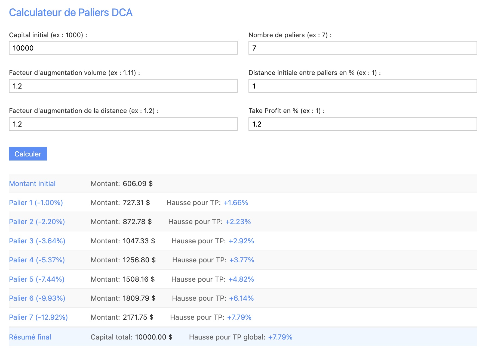

# Calculateur de Paliers DCA

Le **Calculateur de Paliers DCA** est une application web conçue pour aider les investisseurs à calculer les paliers d'achat en utilisant la méthode DCA (Dollar-Cost Averaging). Cette méthode permet de répartir les investissements sur plusieurs paliers pour réduire l'impact de la volatilité du marché.

## Fonctionnalités

- **Calcul des paliers** : Détermine les montants à investir à chaque palier en fonction du capital initial et des paramètres définis.
- **Facteur d'augmentation** : Permet de spécifier un facteur d'augmentation du volume d'investissement à chaque palier.
- **Distance entre paliers** : Calcule la distance en pourcentage entre chaque palier d'achat.
- **Take Profit** : Calcule le pourcentage de hausse nécessaire pour atteindre le Take Profit (TP) à chaque palier.
- **Résumé final** : Fournit un résumé du capital total investi et du pourcentage de hausse nécessaire pour atteindre le TP global.

## Comment ça marche ?

1. **Entrez les paramètres** : Capital initial, nombre de paliers, facteur d'augmentation, distance initiale entre paliers, facteur d'augmentation de la distance, et Take Profit.
2. **Cliquez sur "Calculer"** : L'application affiche les montants à investir à chaque palier ainsi que les informations sur le Take Profit.
3. **Analysez les résultats** : Utilisez les informations fournies pour ajuster votre stratégie d'investissement.

## Technologies Utilisées

- HTML5
- CSS3
- JavaScript
